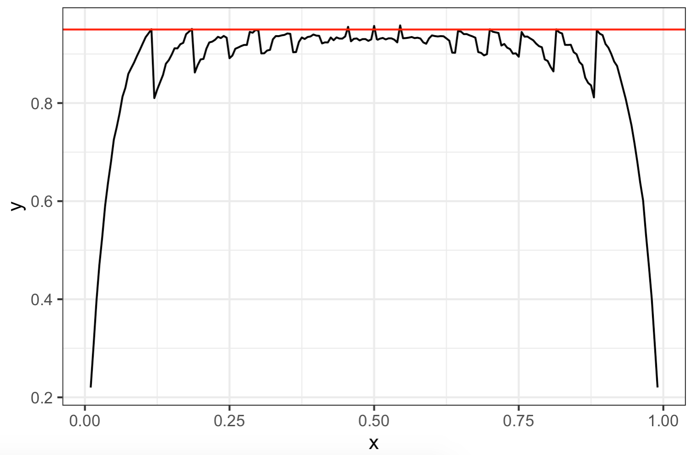

```{r setup, include=FALSE, message=FALSE}
knitr::opts_chunk$set(echo = TRUE)
library("tidyverse");theme_set(theme_bw())
```

In this assignment, you will get to stretch your statistics, functions, and functional programming muscles! Below there a variety of questions that will give you experience in making and using functions to investigate statistical concepts. These tasks will be your first baby steps into simulation, which is an essential component of the modeling and data science process. 

## Getting started

Here are the steps for getting started:

- Start with the assignment link that creates a repo on GitHub with starter documents. I have sent this to you through email.
- Clone this repo in RStudio
- Make any changes needed as outlined by the tasks you need to complete for the assignment
- Periodically commit changes (the more often the better, for example, once per each new task)
    + Remember, git will yell at you when you try to commit before running the following lines in the terminal
        - `git config --global user.name "Your Name Here"`
        - `git config --global user.email "Your Email Here"`
- Push all your changes back to your GitHub repo

and voila, you're done! Once you push your changes back you do not need to do anything else to "submit" your work. And you can of course push multiple times throughout the assignment. At the time of the deadline I will take whatever is in your repo and consider it your final submission, and grade the state of your work at that time (which means even if you made mistakes before then, you wouldn't be penalized for them as long as the final state of your work is correct).


### Question 1: The Bootstrap

The bootstrap is a set of statistical methods that use re-sampling to build up statistical theory "by the bootstraps". Traditional statistical inference that you learn in an introductory statistics course relies upon a theoretical sampling distribution, which describes the behavior of a statistic using probability. For the sample mean $\bar{x}$ and the sample proportion $\hat{p}$, the central limit theorem provides us a strong statistical result to rely on. But what about the sample standard deviation or the sample median? They don't have the theory to back up assuming that the sampling distribution follows a normal distribution. That's where the bootstrap comes in! The bootstrap basically builds up its own version of a sampling distribution, treating the original sample as the population. The bootstrap is really quite simple! Here are the steps:

1. Take the original sample, which has a sample size of $n$, and treat it like the population.
2. Take a sample of size $n$, with replacement, from the new population (original sample)
3. Calculate the statistic for that sample
4. Repeat steps 2 and 3 for a large number of times (10000 or more).
5. Create a histogram of the statistics.

The resulting histogram is called the bootstrap distribution. We can use that distribution to create a confidence interval or conduct a hypothesis test.

__Question Starts Here:__

For this question, we are going to create a 95% bootstrap confidence interval for the sample standard deviation!! 

The following steps are what you need to complete in order to create the proper interval. A general hint is that you should try to think about how to do this once, and then generalize.

1. Create 10000 samples, of size n, from the original population `samp` using `rerun()` and `sample()`. Remember to sample with replacement, `replace = TRUE` inside `sample()`, and make sure each sample is of the same size as the population, `n = 25`.
2. Find the standard deviation of each dataset using the `map_dbl()` function and the `sd()` function inside `map_dbl()`.
3. The bounds of a 95% bootstrap confidence interval are found by taking the 2.5th percentile and the 97.5th percentile of the standard deviations found in step 2. To find percentiles, you use the `quantile()` function.
4. To finish the question off, plot a histogram of the standard deviations to see the bootstrap distribution.


## Question 2: A Coverage Simulation

In the last question, I asked you to make a 95% confidence interval. What does the 95% part of the confidence interval mean? This is one of the most challenging parts of a confidence interval for people in an intro stat class. Remember that the goal of a confidence interval is to estimate the true value of a characteristic of the population, called a parameter. The interpretation that makes the most sense for us is the following: "If I were to take many samples of the same size from the population, and compute a confidence interval for each sample using the same method, then 95% of the intervals should contain the true value of the parameter". This is called the coverage interpretation of a confidence interval. Coverage for a confidence interval is defined as the proportion of times the intervals contained the truth. Did you ever wonder if the interval actually lives up to the theory? In other words, does the method we use actually create intervals that contain the truth 95% of the time? In theory, yes they do! In practice, sometimes not so much...


The traditional confidence interval used to estimate the population proportion has notoriously bad coverage behavior! As a reminder, to estimate a population proportion $p$, we use the interval $$\hat{p} \pm z_{\alpha / 2} \times \sqrt{\dfrac{\hat{p}(1 - \hat{p})}{n}}$$ where $\hat{p}$ is the sample proportion, $n$ is the sample size, and $z_{\alpha / 2}$ is a critical value of the standard normal distribution based on the confidence level. The sample proportion $\hat{p}$ is called the point estimate and $\sqrt{\dfrac{\hat{p}(1 - \hat{p})}{n}}$ is called the standard error. 

__Question Starts Here:__

In order to evaluate the coverage behavior of an interval in general, the following steps need to be taken:

1. Fix a sample size $n$ and some true value for the parameter. 
2. Simulate many samples from the population with the same $n$ and parameter value.
3. For each sample, construct the confidence interval.
4. Check whether or not the interval contains the true parameter value.
5. Find the proportion of intervals that contained the truth.


I want you to do this for the confidence interval for $p$ described above! To do so, complete the following steps:

1. Create a function called `z_int()` that takes in the data, which will be in a series of 0's and 1's (corresponding to no and yes), and a specific confidence level called `conf`. You'll want to output a vector of length 2 with the endpoints of the interval. I have started the function below and calculated the critical value because it is the most challenging part. 

2. The data for this type of problem is a series of successes and failures. We will encode 0 as a failure and 1 as a success. The way that we can simulate a series of successes and failures that have a common probability of success $p$ is with a binomial distribution. To be specific, if I wanted simulate a sample of 25 successes and failures with the probability of success being $0.25$, I would write `rbinom(n = 25, 1, p = 0.25)`. I want you to simulate 10000 samples of size `n = 25` from a binomial distribution with probability of success $p = 0.25$. You'll again want to use the `rerun()` function. The result should be a list of vectors that contain a bunch of 0's and 1's.

3. Compute the confidence interval for each of the samples. This will entail mapping the interval function to each of the samples using the `map_dbl()` function. It may be useful to use purrr's anonymous function syntax.

4. This is the tricky part! We need to check whether or not the intervals actually contain the true value of the parameter. Again, we will want to use purrr's functionals to do this! There are a few different ways to complete this part! You can create a separate function that checks if the true parameter is in the interval or you can use purrr's anonymous functions with the `map_lgl()` function. For instance, if I wanted to check if `a <- 0.25` is inside the interval `x <- c(.22, .36)`, I would run the code `x[1] <= a && a <= x[2]`. 

5. Lastly, you need to calculate the proportion of intervals that contain the true value of the parameter. After completing step 4, you should have a list or vector of true's and false's. To find the proportion of true's, you just need to take the mean of the logical vectors. 

At the end, you should have one number between 0 and 1. That number is the actual coverage of the interval at that point. Theoretically, it should be near 0.95, but it will probably closer to .90!


__Extra Credit:__ We did the simulation for fixed $n$ and fixed $p$, but what happens to the behavior when you vary $p$? To answer this, I want you to apply the simulation you just completed above to a fine mesh of probabilities (you can keep the number of simulations and the sample size the same). I've placed the fine mesh in the code chunk below! After finding the coverage probability for each $p$, I want you to plot the results as a line, as well as a horizontal line at the nominal 95% coverage point. Your graph should be close to the image below:  
```{r fig, echo=FALSE, fig.align='center', fig.height=2, fig.width=3}

```

## Question 3: A 538 Riddler Question

The Riddler is a weekly 538 article about math puzzles! You can find "The Riddler" weekly article here:[https://fivethirtyeight.com/tag/the-riddler/](https://fivethirtyeight.com/tag/the-riddler/). In one of the more recent articles, they ask in interesting question about rolling dice. Here's the question:

"You start with a fair 6-sided die and roll it six times, recording the results of each roll. You then write these numbers on the six faces of another, unlabeled fair die. For example, if your six rolls were 3, 5, 3, 6, 1 and 2, then your second die wouldn’t have a 4 on it; instead, it would have two 3s.

Next, you roll this second die six times. You take those six numbers and write them on the faces of yet another fair die, and you continue this process of generating a new die from the previous one.

Eventually, you’ll have a die with the same number on all six faces. What is the average number of rolls it will take to reach this state?"


__Question Starts Here:__

I want you to create a simulation to try and answer this question! David Robinson has done a screen-cast on it, but don't copy his code! I am looking for you to use simple controls and looping structures to accomplish this task. There are only a couple of components to this problem:

* Rolling the dice: This is accomplished using our old friend, the `sample()` function. Every time you roll the dice, you will feed the previous roll into sample again.
* Determining when to stop: No matter what type of loop you use, you need some stopping criteria. The output of sample is a vector, and so you need to know when the vector becomes all one number. I suggest a combination of the `length()` and `unique()` functions. 
* Keeping count of iterations: One way or another, you have to keep track of how many iteration you went through until you have all of the same faces. This may be easily built into your simulation or you may have to add a variable that keeps count. 

To complete the task, you will want to prototype your function (make sure that it works for one run of roll sequence) and then use `rerun()` to run the simulation many times (10000 or more). Then find the average of all the simulations to answer the question.